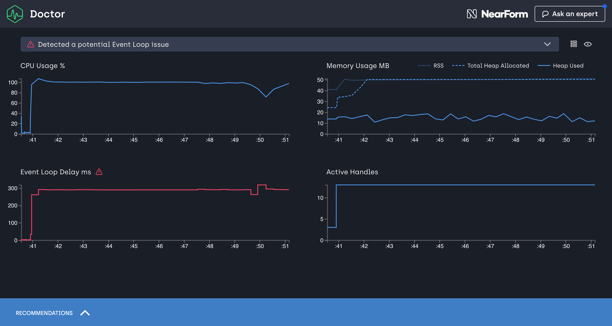

# Clinic.js Doctor

[](https://greenkeeper.io/)
[![npm version][npm-version]][npm-url] [![Stability Stable][stability-stable]][stability-docs] [![Azure Pipelines build status][azure-status]][azure-url]
[![Downloads][npm-downloads]][npm-url] [![Code style][lint-standard]][lint-standard-url]

Programmable interface to [Clinic.js][clinic-url] Doctor. Learn more about Clinic.js: https://clinicjs.org/



## Supported node versions

* Node.js 10.0.0 and above
* Node.js 9.4.0 and above
* Node.js 8.10.0 and above

Node.js 8.9.4 also works, however you have to listen to `SIGINT` and shutdown
the process nicely.

## Example

```js
const ClinicDoctor = require('@nearform/doctor')
const doctor = new ClinicDoctor()

doctor.collect(['node', './path-to-script.js'], function (err, filepath) {
  if (err) throw err

  doctor.visualize(filepath, filepath + '.html', function (err) {
    if (err) throw err
  });
})
```

You can find examples in
[node-clinic-doctor-examples](https://github.com/nearform/node-clinic-doctor-examples)

## Documentation

```js
const ClinicDoctor = require('@nearform/doctor')
const doctor = new ClinicDoctor()
```

### new ClinicDoctor([settings])

* settings [`<Object>`][]
  * sampleInterval [`<Number>`][] Time between each sample in milliseconds.
    **Default**: 10
  * detectPort [`<boolean>`][] **Default**: false
  * dest [`<String>`][] The folder where the collected data is stored. **Default**: '.'
  * debug [`<boolean>`][] If set to true, the generated html will not be minified.
    **Default**: false
  * collectDelay [`<Number>`][] **Default**: 0

#### `doctor.collect(args, callback)`

Starts a process by using:

```js
const { spawn } = require('child_process')
spawn(args[0], ['-r', 'sampler.js'].concat(args.slice(1)))
```

The injected sampler will produce a file in the current working directory, with
the process PID in its filename. The filepath relative to the current working
directory will be the value in the callback.

stdout, stderr, and stdin will be relayed to the calling process. As will the
`SIGINT` event.

#### `doctor.visualize(dataFilename, outputFilename, callback)`

Will consume the datafile specified by `dataFilename`, this datafile will be
produced by the sampler using `doctor.collect`.

`doctor.visualize` will then output a standalone HTML file to `outputFilename`.
When completed the `callback` will be called with no extra arguments, except a
possible error.

## License
[GPL 3.0](LICENSE)

[stability-stable]: https://img.shields.io/badge/stability-stable-green.svg?style=flat-square
[stability-docs]: https://nodejs.org/api/documentation.html#documentation_stability_index
[npm-version]: https://img.shields.io/npm/v/@nearform/clinic-doctor.svg?style=flat-square
[npm-url]: https://www.npmjs.org/@nearform/clinic-doctor
[npm-downloads]: http://img.shields.io/npm/dm/@nearform/clinic-doctor.svg?style=flat-square
[lint-standard]: https://img.shields.io/badge/code%20style-standard-brightgreen.svg?style=flat-square
[lint-standard-url]: https://github.com/feross/standard
[clinic-url]: https://github.com/nearform/node-clinic
[`<Object>`]: https://developer.mozilla.org/en-US/docs/Web/JavaScript/Reference/Global_Objects/Object
[`<boolean>`]: https://developer.mozilla.org/en-US/docs/Web/JavaScript/Data_structures#Boolean_type
[`<Number>`]: https://developer.mozilla.org/en-US/docs/Web/JavaScript/Data_structures#Number_type
[`<String>`]: https://developer.mozilla.org/en-US/docs/Web/JavaScript/Reference/Global_Objects/String
[azure-status]: https://dev.azure.com/node-clinic/node-clinic/_apis/build/status/nearform.node-clinic-doctor
[azure-url]: https://dev.azure.com/node-clinic/node-clinic/_apis/build/status/nearform.node-clinic-doctor?branchName=master
